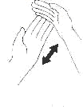

# Banned Phrases Sign Language

## Bang out

### Definition: 
To remove oneself from a locale

### Action: 
Clench both fists together as if grasping an ejection handle, place in between the legs and “pull” upwards in line with the abdomen.

### Related definitions:

    Foxtrot oscar
    Make like a...
    Retrograde
    SID (any Major Road Name)

## Basics

### Definition: 
Something elementary has been forgotten or neglected. Often used as a reprimand.

### Action: 
Hold both hands out flat with one perpendicular to the other but still in the same plane; slap the back of the hand closest to you into the palm of the one furthest away.

###Related definitions:

    Schoolboy (error)

## Bread and butter

### Definition: 
Term used to describe actions that are used so often that they are often considered the basic principles of the subject under discussion.

### Action: 
Hold one hand flat and place the other perpendicular in the other plane like a knife; move the top hand up the fingers and down the wrist of the open palm.

### Related definitions:

    Meat and two veg
    Pain au beurre
    Schoolboy (error)

## Bzzz

### Definition: 
Used to signal disinterest or irrelevance of the current topic of discussion.

### Action: 
Clench a fist and then extend thumb and forefinger; move hand forward as if pressing an imaginary button.

## Chin it off

### Definition:
Dispense with something, as it is considered to not be sufficiently important.

### Action: 
Open the hand flat and hold it up with the fingers just touching the underside of the chin with the palm facing you; move the hand away from the face with a swift brushing motion

## Crinkle

### Definition: 
Description of someone who has become obviously angry or upset. Usually used to provoke further anger. May be accompanied by annoying hand gesture.

### Action: 
Using index finger, start at the corner of the mouth and describe a jagged line from one side of the mouth to the other.

## End of

### Definition: 
This topic of the conversation is over, nothing you say to me about it will be acknowledged from now on.

### Action: 
Hold out a flat hand perpendicular to the arm and parallel with the abdomen; push the palm away from the body once.

## Endex

### Definition: 
Finish.

### Action: 
Hold a flat hand directly under the chin with the palm facing the floor; rotate the hand about the axis of the wrist in a slicing motion.

## In

### Definition: 
Used to indicate success or that something is good.

### Action: 
Rotate the index and middle fingers in an anticlockwise direction and then point them sharply downwards.

## Out

### Definition: 
Used to indicate failure or that something is bad.

### Action: 
Rotate the index and middle fingers in a clockwise direction and then point thumb up and out

## There I was

### Definition: 
I am about to bore you with a story of my aviation prowess.

### Action: 
With the left hand make a fist facing knuckles forward and palm down, as if holding a throttle. With the right hand make a loose fist facing knuckles forward and palm towards the other hand, as if holding a control column. Move both back and forward a few centimetres at a frequency of 1 hertz.

## Wheels is wheels

### Definition: 
The stated time of departure for the transport has passed and therefore we should depart without delay even if there are still people yet to board.

### Action: 
Clench a fist and then extend the forefinger; tap the wrist repeatedly with the forefinger.

